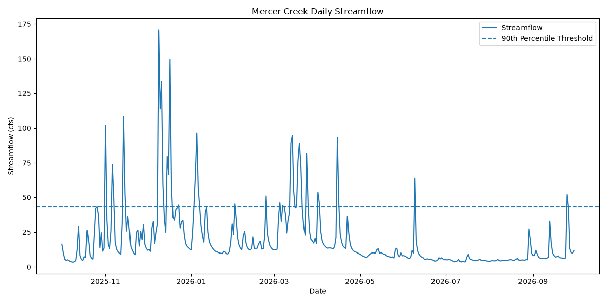
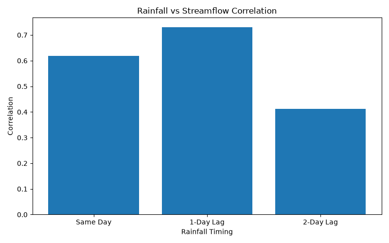
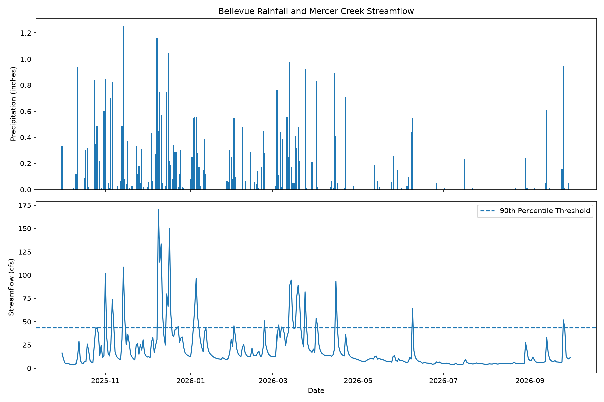
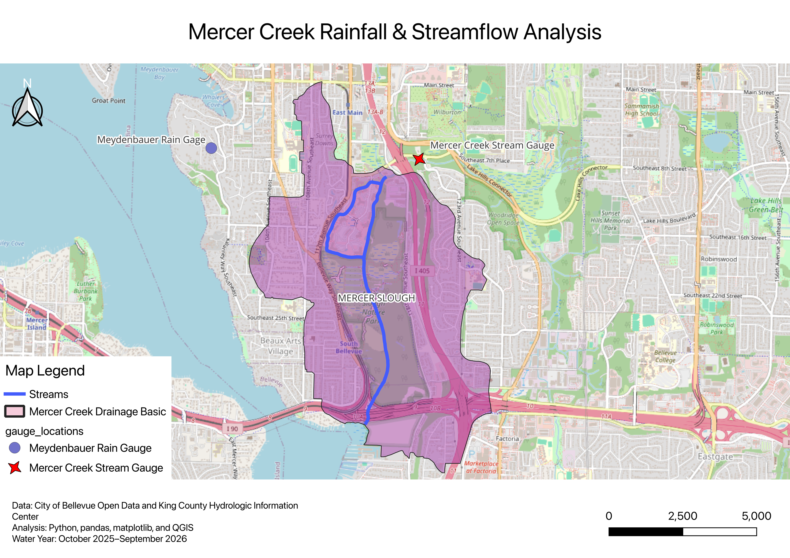

# Stormwater Runoff Analyzer

A Python and GIS project exploring the relationship between rainfall and streamflow in Bellevue, Washington.

The project uses public hydrologic data from King County and spatial data from the City of Bellevue to examine how rainfall events relate to changes in Mercer Creek streamflow.

## Project Goals

This project was built to practice combining software engineering, data analysis, and GIS workflows using real environmental data.

The analysis focuses on:

- Daily rainfall and streamflow patterns
- High-flow events
- Rainfall-to-streamflow lag
- Individual storm events
- Spatial relationships between monitoring stations, Mercer Creek, and the surrounding drainage basin

## Data

The analysis uses one water year of daily observations from October 1, 2025 through September 30, 2026.

Hydrologic monitoring stations:

- `COB_MCF` — Mercer Creek Stream Gauge
- `COB_RG05` — Meydenbauer Rain Gage

Streamflow observations include provisional measurements as identified by King County.

Spatial data includes Bellevue stream and storm drainage basin datasets.

## Python Analysis

The Python workflow uses pandas to clean, merge, and analyze daily precipitation and streamflow observations.

Average Mercer Creek streamflow during the study period was approximately **19.71 cfs**.

The highest observed streamflow was **170.7 cfs on December 9, 2025**.

A 90th-percentile threshold of approximately **43.56 cfs** was used as a data-driven way to identify unusually high-flow days.

## Rainfall and Streamflow

Daily rainfall and streamflow showed a positive relationship.

The correlation between same-day rainfall and streamflow was:

**0.618**

Because streamflow may respond after rainfall has had time to move through the watershed, rainfall was also shifted by one and two days.

| Rainfall timing | Correlation with streamflow |
| --- | ---: |
| Same day | 0.618 |
| 1-day lag | 0.731 |
| 2-day lag | 0.412 |

The strongest relationship occurred with rainfall from the **previous day**, with a correlation of **0.731**.

This suggests that Mercer Creek streamflow often responds most strongly about one day after rainfall during this study period.

## Storm Event Example

The highest streamflow event provides a clear example of the delayed response.

On **December 8, 2025**, the rainfall gauge recorded **1.16 inches of precipitation**, while Mercer Creek streamflow was **30.87 cfs**.

On **December 9**, rainfall decreased to **0.45 inches**, but streamflow increased sharply to **170.7 cfs**, the highest daily flow recorded during the study period.

This event is consistent with the stronger one-day lag relationship found in the year-long analysis.

## GIS Analysis

QGIS was used to place the hydrologic observations into geographic context.

The map combines:

- Mercer Creek
- the surrounding storm drainage basin
- the Mercer Creek streamflow gauge
- the Meydenbauer rainfall gauge
- an OpenStreetMap basemap

The spatial analysis helps show that the rainfall and streamflow measurements represent different monitoring locations within the Bellevue drainage system rather than measurements collected at the same point.

## Tools

**Python:** pandas, matplotlib  
**GIS:** QGIS  
**Data:** King County Hydrologic Information Center, City of Bellevue Open Data  
**Version Control:** Git and GitHub

## Key Takeaway

Rainfall and Mercer Creek streamflow showed a clear positive relationship during the 2025–2026 water year.

The strongest correlation occurred when rainfall was shifted one day earlier, suggesting that watershed response time is an important part of understanding the relationship between precipitation and streamflow.

Individual storms varied, however, demonstrating that rainfall-streamflow relationships cannot be explained by a single timing pattern alone.

## Future Improvements

Future versions could incorporate higher-resolution storm data, additional rainfall gauges, watershed characteristics, impervious surface data, and automated geospatial analysis using Python libraries such as GeoPandas.